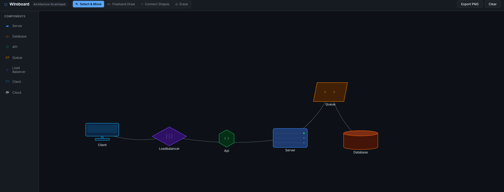

# Wireboard

A minimal whiteboard for drawing architecture diagrams. Drop in pre-built shapes — servers, databases, APIs, queues, load balancers — connect them with arrows, annotate with freehand drawing, and export as PNG. Boards auto-save so you can pick up where you left off. Built for engineers who just want to sketch something out fast without fighting a general-purpose tool.



---

## Stack

React + TypeScript + Vite — Express + MongoDB

---

## Running locally

Make sure MongoDB is running, then:

```bash
cd server && npm install && npm run dev
```

```bash
cd client && npm install && npm run dev
```

Open [http://localhost:5173](http://localhost:5173)

> No MongoDB? It still works — data just resets on server restart.

---

## Usage

| Action | How |
|--------|-----|
| Add a shape | Click any component in the left panel |
| Move shapes | Select tool → drag |
| Connect shapes | Connector tool → click shape A → click shape B |
| Rename a shape | Double-click it |
| Erase | Eraser tool → click any shape or connector |
| Freehand draw | Draw tool |
| Delete selected | `Delete` or `Backspace` |
| Cancel operation | `Escape` |
| Export diagram | “Export PNG” button |
